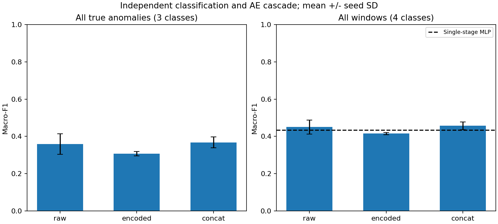
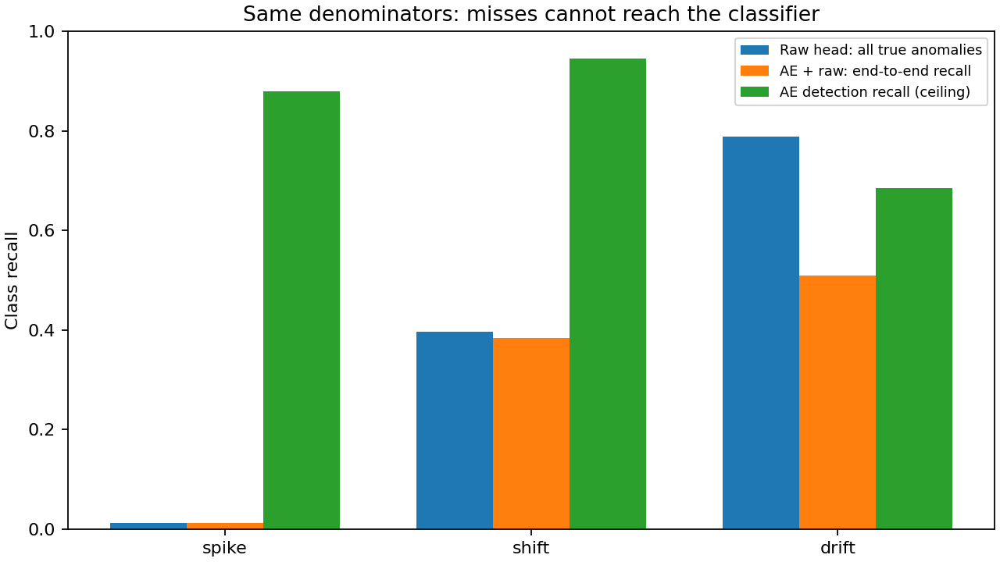
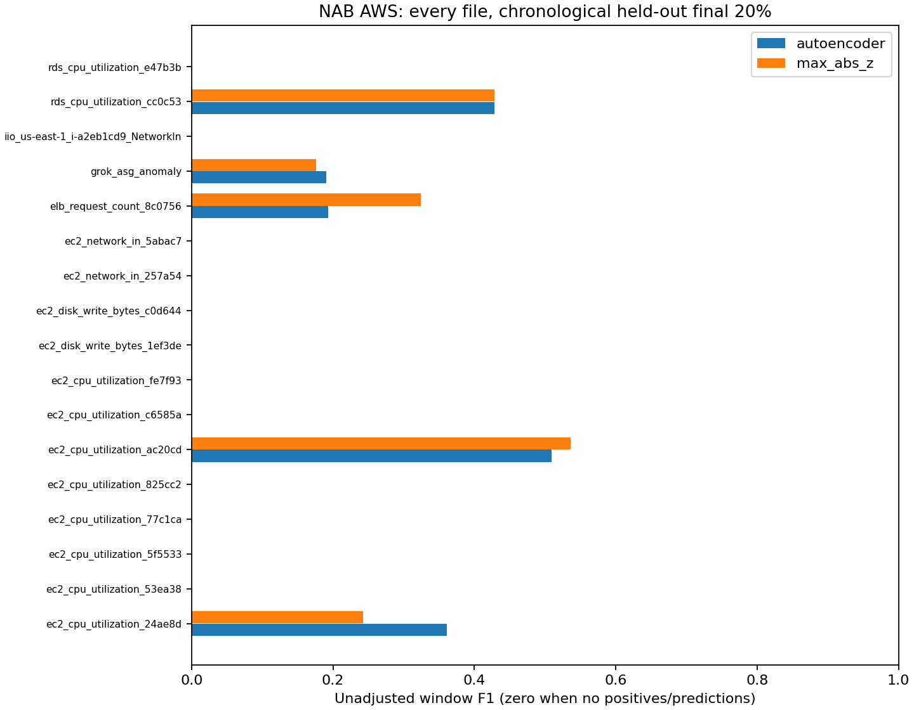
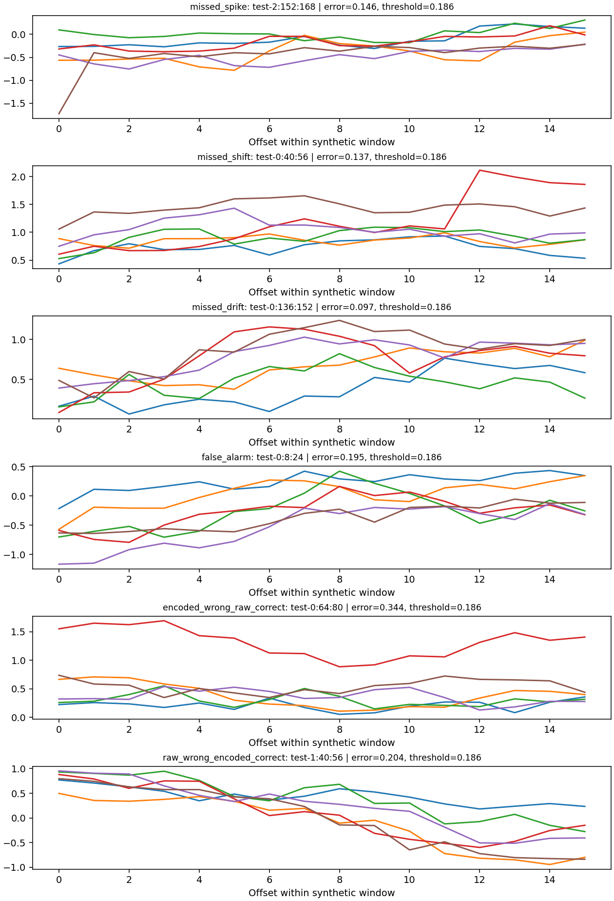

# Two-Stage Anomaly Study

**Independent post-internship study using synthetic and public data; not affiliated with or endorsed by Nokia.**

A small CPU/PyTorch reproduction and failure analysis, motivated by network monitoring:
does an Autoencoder trained only on normal data retain information needed to distinguish
anomaly types, and how do detector misses limit downstream diagnosis?

This is an engineering study, not a new-method claim or a reconstruction of an employer's
code, experiments, or production system. It contains no company data, internal code,
customer information, or branding. The synthetic labels describe **shapes**, not network
fault causes. Development, tests, execution and documentation were assisted by OpenAI
Codex; this repository does not imply that every implementation step was performed manually.

## Run on CPU

Python 3.10+ (recorded run: 3.12.10). No API key, GPU, paid service or model download is required.
From the repository root, preferably in a fresh virtual environment:

```bash
python -m venv .venv
# Windows PowerShell: .venv\Scripts\Activate.ps1
# Linux/macOS: source .venv/bin/activate
python -m pip install torch --index-url https://download.pytorch.org/whl/cpu
python -m pip install -e ".[test]"
```

One-command small example, after installation:

```bash
python -m anomaly_study.cli synthetic --config configs/quick.json --output results/local-quick
```

Full experiments and checks:

```bash
python -m anomaly_study.cli synthetic --config configs/full.json --output results/synthetic
python -m anomaly_study.cli download --data data/nab
python -m anomaly_study.cli public --config configs/full.json --data data/nab --output results/public
python -m anomaly_study.report
python -m pytest -q
python -m ruff check src tests
python -m ruff format --check src tests
python scripts/audit_results.py
```

The public command uses the first configured seed (17). It evaluates all 17 AWS files;
synthetic experiments use seeds 17, 29 and 43. `results/quick/` contains an actually executed
five-epoch smoke example, not the headline experiment. Published figures and metrics are
in `results/synthetic/` and `results/public/`. Use a different output directory to preserve them.
Recorded direct dependency versions are in `requirements-repro.txt`; numerical reproducibility
across different hardware/library versions is not guaranteed. Timing is inherently variable.

## Methods and evaluation

- **AE detector:** flattened standardized 16-step windows → 64 → 8 → 64 → reconstruction;
  mean squared reconstruction error over all coordinates; trained only on normal training windows.
- **Statistical detector:** maximum absolute standardized coordinate, using the same training
  mean/scale and a separate calibration threshold. It is simple, not an outlier-robust estimator.
- **Anomaly heads:** raw (96 dimensions), frozen encoding (8), or concatenation (104), followed
  by `Linear → ReLU → Linear` with hidden width 32 and three outputs.
- **Single-stage baseline:** raw input, same hidden width, four outputs including normal.
  It uses supervised normal and abnormal training windows. This differs from the AE's supervision.
- **Budgets:** Adam, lr 0.001, batch 128, 35 epochs. The three anomaly heads share samples,
  shuffle seed and training budget. Checkpoint selection uses validation loss. No hyperparameter
  search or test-set-driven tuning was performed. Single-stage gets more updates because it sees
  more training windows; every model's sample and update counts are reported.

Synthetic sequences are allocated to train/calibration/validation/test **before windowing**:
40/16/16/24 independent sequences, each 320 steps and six correlated channels. Each non-calibration
sequence contains one spike, one sustained shift and one gradual drift at randomized positions,
channels, signs and amplitudes. Calibration sequences are entirely normal. This intentionally
simple stationary generator has much cleaner variation than real networks.

Windows have width 16 and stride 8. A window is anomalous if any source point is anomalous;
the generator separates events so windows never mix types. Predictions are made at window end.
Overlapping windows within a split are correlated; none share source points across splits.
Normalization uses **normal training windows only**. Both detector thresholds are the empirical
95th percentile (`method="higher"`) of **independent normal calibration** scores, with a strict
`score > threshold` decision. The normal calibration set does not provide a 5% future FPR guarantee,
especially under dependence or distribution shift. Validation chooses checkpoints; test labels
are used only to score predictions and inspect failures.

Three distinct evaluations are retained:

1. Detection, anomaly positive: precision, recall, F1, false-positive rate and PR-AUC, implemented
   as **average precision (AP)**, not trapezoidal PR integration.
2. Independent diagnosis on **all true anomalous test windows**, including detector misses.
3. Complete pipeline on **all test windows**: rejected windows become normal, and falsely flagged
   normal windows receive an anomaly class. Full confusion matrices and per-class recalls are saved.

No point adjustment, event credit expansion, event-level metric, or exclusion of inconvenient test
segments is used. Absent-class multiclass recalls and undefined AP are `null`; zero-denominator
precision/recall/F1 use zero. Fixed-label macro-F1 includes absent classes as zero. Full definitions,
counts, parameter budgets and all matrices are in [the measured report](docs/RESULTS.md).

## Actual results

Synthetic results: mean ± sample SD over three fixed seeds, 936 test windows per seed.

| Detector | Precision | Recall | F1 | False-positive rate | PR-AUC (AP) |
|---|---:|---:|---:|---:|---:|
| Autoencoder | 0.924 ± 0.034 | 0.808 ± 0.035 | 0.861 ± 0.005 | 0.047 ± 0.024 | 0.937 ± 0.004 |
| Max absolute z-score | 0.884 ± 0.011 | 0.556 ± 0.049 | 0.682 ± 0.040 | 0.050 ± 0.003 | 0.821 ± 0.027 |

| Classifier input | Head parameters | Independent 3-class macro-F1 | AE cascade 4-class macro-F1 |
|---|---:|---:|---:|
| Raw | 3,203 | 0.359 ± 0.055 | 0.450 ± 0.038 |
| Encoded | 387 | 0.307 ± 0.012 | 0.415 ± 0.005 |
| Concatenated | 3,459 | 0.368 ± 0.030 | 0.457 ± 0.020 |
| Single-stage raw | 3,236 | Not applicable | 0.435 ± 0.009 |

The two macro-F1 columns have different class sets and populations: a higher four-class number
does **not** show that gating improved anomaly classification. The AE has 13,544 parameters,
in addition to the anomaly head. Encoded inputs perform worse here, but their head is also much
smaller and the features have different scales. These experiments do **not** isolate irreversible
information loss from capacity, optimization, imbalance or scaling effects. Concatenation's small
mean advantage over raw input is not evidence of a robust representation benefit with three seeds.




Public data: the entire NAB `realAWSCloudwatch` directory, separate per-series models, one seed,
1,665 held-out windows (177 positive). This is a **custom binary window task, not the official NAB score**.

| Detector | Precision | Recall | F1 | False-positive rate | PR-AUC (AP) |
|---|---:|---:|---:|---:|---:|
| Autoencoder | 0.160 | 0.469 | 0.239 | 0.292 | 0.152 |
| Max absolute z-score | 0.164 | 0.463 | 0.242 | 0.281 | 0.172 |

The statistical baseline slightly wins on pooled F1/AP. Neither method transfers the synthetic
performance to these public series. Twelve final test segments have no labeled anomalies; they
remain in false-positive accounting. These findings do not establish real network fault diagnosis.



## Failures worth examining

The examples below are the **first** matching windows in seed 17, not the most dramatic examples.
Their actual six-channel values, scores and predictions are in `results/synthetic/failures_17.json`.

| Window | Observation | Bounded interpretation |
|---|---|---|
| `test-2:152:168` | Spike, error 0.146 ≤ threshold 0.186 | A short/edge-localized change can be diluted when MSE averages 96 coordinates. |
| `test-0:40:56` | Shift, error 0.137 ≤ threshold | Partial event coverage may not produce sufficient window-average deviation. |
| `test-0:136:152` | Drift; every head predicts drift, but error 0.097 ≤ threshold | The classifier can be correct independently and still yield normal in the cascade. |
| `test-0:8:24` | Normal, error 0.195 > threshold; all heads say shift | The forced three-class head cannot reject a detector false alarm. |
| `test-0:64:80` | Shift; raw correct, encoded wrong | Normal reconstruction training does not ensure good downstream anomaly separation. |
| `test-1:40:56` | Drift; encoded correct, raw wrong | Encoding is not uniformly worse on individual samples. |



These explanations describe plausible mechanisms and measured decisions, not causal proof.
The very low spike diagnosis recall is a major limitation: equal event counts create unequal
window counts because spikes are brief. Unweighted cross-entropy and partial-event windows make
the task harder. Class balancing, capacity matching, feature scaling and longer temporal context
are future controls, not completed improvements.

For class k, end-to-end recall is `P(detected | k) × P(classified as k | detected, k)`.
It is **not** generally detection recall times independent-head recall: the conditioning differs.
It cannot exceed detector recall for that class. See [failure analysis](docs/FAILURE_ANALYSIS.md).

## Public data provenance

Source: [Numenta NAB](https://github.com/numenta/NAB), fixed commit
`ea702d75cc2258d9d7dd35ca8e5e2539d71f3140`, MIT-licensed at that revision.
[Dataset documentation](https://github.com/numenta/NAB/blob/ea702d75cc2258d9d7dd35ca8e5e2539d71f3140/data/README.md)
identifies AWS CloudWatch metrics. The download script records SHA-256 hashes and retains upstream
license text locally; no raw public data is committed. Citation: Ahmad, Lavin, Purdy & Agha (2017),
*Unsupervised real-time anomaly detection for streaming data*, Neurocomputing,
[doi:10.1016/j.neucom.2017.04.070](https://doi.org/10.1016/j.neucom.2017.04.070).

`combined_windows.json` defines broad anomaly intervals, not fault types or precise durations.
We label timestamps within those intervals as positive and label a model window positive on any
overlap. Per-series chronological split: 40% train, 20% calibration, 20% validation, 20% test, before
window creation. Normal-window filtering in train/calibration and normal validation checkpointing
uses known benchmark labels—an oracle-clean normal-data assumption, not unsupervised online discovery.

Two upstream files have 11 duplicate timestamp rows each. Values at the same timestamp are averaged
before splitting, without consulting labels; this avoids identical timestamps straddling splits.
No interpolation, sorting of out-of-order rows, balancing or result-based file filtering is performed.
See [data protocol](docs/DATA_PROTOCOL.md) and `results/public/data_manifest.json`.

## Files, reproducibility and limits

```text
configs/                 Fixed quick/full JSON configurations
src/anomaly_study/        Data, models, metrics, experiments, public adapter, plots, reports
tests/                   Leakage, calibration, propagation and boundary-case tests
scripts/audit_results.py  Recompute metrics from saved predictions and verify artifact consistency
results/                 Measured JSON, derived prediction CSVs and generated figures
docs/                    Experiment results, failure analysis, validation and provenance
```

CPU timing uses an Intel Core i7-13700H, one PyTorch thread, pre-standardized tensors, 20 warmups
and 100 `perf_counter_ns` repetitions under `torch.inference_mode`. It measures actual model/gate
execution; excludes preprocessing, disk/network I/O and thread scheduling. Batch sizes and p95
are saved. A faster head alone need not make the complete cascade faster. This is not a production
latency guarantee. No streaming/multithread deployment is claimed or included.

Results are intentionally limited: one small synthetic generator, three seeds, a single latent
width, unequal head capacities, unweighted class loss, correlated windows, 17 univariate public
series and one public seed. There is no held-out-real-fault-type evaluation, calibrated uncertainty,
open-set rejection, production validation or new-method novelty claim.

Code and authored documents: [MIT](LICENSE). Dependencies are installed, not vendored;
[third-party notices](THIRD_PARTY_NOTICES.md) list their licenses and upstream attribution.
