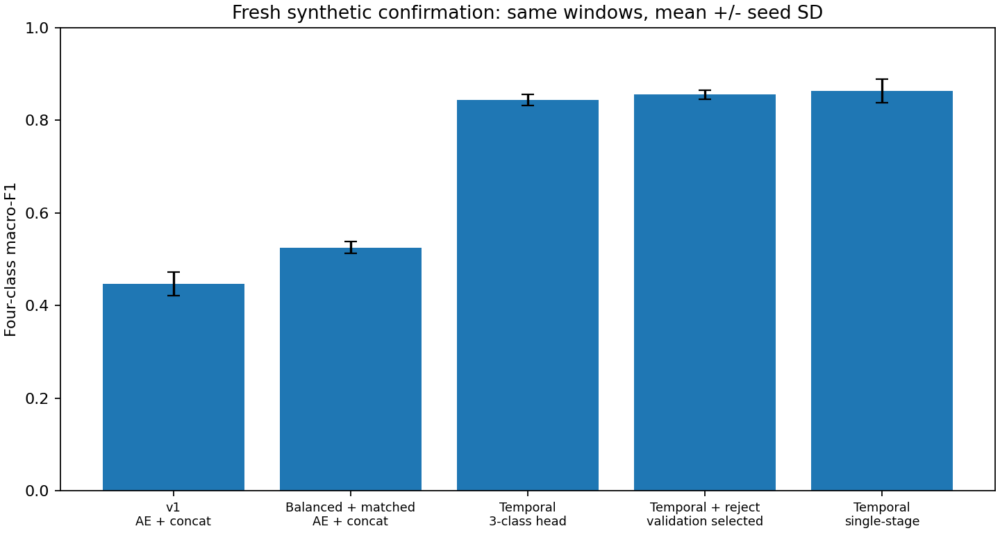
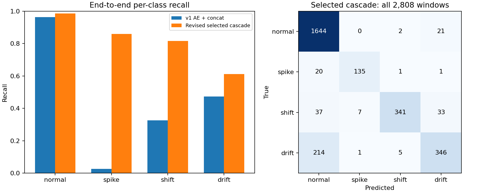
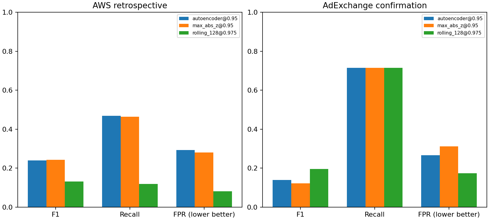
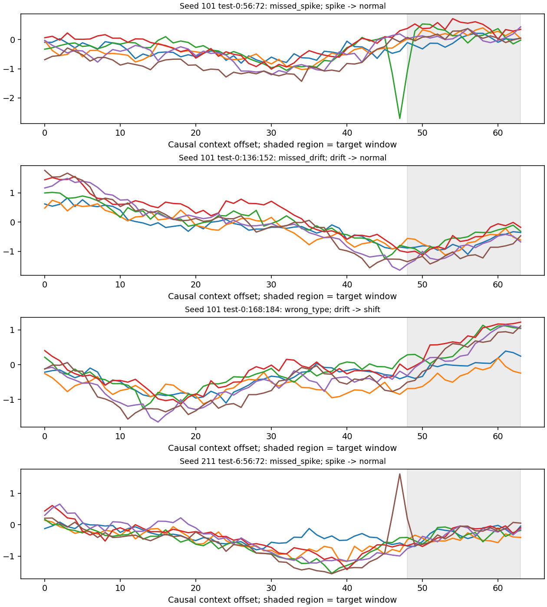

# Two-Stage Anomaly Study

**Independent post-internship study using synthetic and public data; not affiliated with or endorsed by Nokia.**

A CPU/PyTorch engineering reproduction of anomaly detection and diagnosis, with explicit failure
analysis. The question is whether normal-data Autoencoder representations support anomaly-type
classification, and how detector mistakes propagate through a two-stage pipeline.

The current revision fixes class-imbalanced training, unequal head parameter budgets, unscaled
encoded features, limited temporal information and forced classification of detector false alarms.
It substantially improves synthetic diagnosis. It does **not** establish a universally superior
anomaly detector, a new method, or production performance. No company code, internal data,
customer information or branding is included. OpenAI Codex assisted implementation, execution,
testing and documentation; no AI API or GPU is required at runtime.

## Confirmed results

The revision protocol and validation choices were committed before evaluating fresh test seeds
101/211/307. The generator, anomaly strengths, target labels and test inclusion rules were unchanged.
Each seed has 936 test windows. Every row below uses the **same new test windows**, not the old
published tests. Values are mean ± sample SD over three seeds.

| System | Complete-pipeline macro-F1 | Spike recall | Shift recall | Drift recall |
|---|---:|---:|---:|---:|
| Original AE + concatenated-input MLP | 0.446 ± 0.025 | 0.025 ± 0.028 | 0.326 ± 0.076 | 0.474 ± 0.036 |
| Revised AE + temporal features + normal rejection | **0.855 ± 0.009** | **0.860 ± 0.031** | **0.816 ± 0.062** | **0.611 ± 0.031** |

**The improvement is real, but the attribution matters.** A single-stage MLP using exactly the same
revised temporal features and four-class head achieves **0.863 ± 0.026**, slightly above the cascade.
The result supports fixing features and training; it does not prove that an AE gate is necessary.
The selected two-stage model improves over v1 on all three seeds, without switching the selected
model after viewing the new test results.




Public detection also has a clear trade-off. One rolling median/MAD detector and its calibration
quantile were selected on AWS **validation** data under a 10% validation false-positive-rate limit.

| Dataset / detector | Precision | Recall | F1 | FPR | PR-AUC (AP) |
|---|---:|---:|---:|---:|---:|
| AWS, original AE | 0.160 | 0.469 | 0.239 | 0.292 | 0.152 |
| AWS, selected rolling detector | 0.148 | 0.119 | 0.132 | **0.081** | 0.153 |
| New AdExchange confirmation, AE | 0.077 | 0.714 | 0.139 | 0.267 | 0.340 |
| New AdExchange confirmation, selected rolling detector | **0.114** | 0.714 | **0.196** | **0.173** | **0.433** |

AWS is retrospective because its original test results were already known. Its lower FPR costs
recall and F1: this is **not** an across-the-board improvement. The previously unevaluated
AdExchange subset contains only seven positive test windows; its improvement is weak evidence,
not proof of broad generalization. Its FPR still exceeds 10%, illustrating that a validation
constraint does not guarantee a future FPR. No post-confirmation tuning was performed.



See [all revised results](docs/REVISION_RESULTS.md), including individual seeds, capacity controls,
per-class recalls, all confusion matrices, measured latency and actual remaining failures.
[Original results](docs/RESULTS.md) and their JSON/CSV artifacts remain available unchanged.

## What changed and why

1. **Class balance:** inverse-frequency cross-entropy weights are computed only from training
   counts. Equal synthetic event counts do not give equal window counts: brief spikes were rare.
2. **Fairer representation controls:** raw, frozen AE encoding and concatenated inputs all use
   train-fitted feature scaling and approximately 6,400 head parameters (within 1%). They share
   anomalous training samples, batch size, shuffle seed, Adam learning rate and 100 epochs.
   Hidden widths differ to match parameters, so this is not exact functional-capacity equivalence.
3. **Temporal information:** a 64-observation causal context is decomposed with a rank-one channel
   model fitted only on normal training windows. The channel with highest observed target residual
   energy supplies a sign-normalized residual trace and nine shape summaries (73 features).
   No clean generator signal, injected channel, event boundary or future sample is provided.
4. **Second-stage rejection:** a four-class head can return normal after an AE false alarm.
   It trains on all labeled train windows. This same head without gating is the strong single-stage
   comparator; its extra normal supervision and training steps are disclosed.
5. **Public drift control:** trailing median/MAD scores use strictly earlier observations and a
   training-derived scale floor. This statistical baseline can adapt to normal level changes,
   but can also adapt away persistent faults. It is not described as a learned AE improvement.

Matched-capacity diagnosis still does not favor the normal-trained AE encoding:

| Revised input | Head parameters | Independent anomaly macro-F1 | Four-class AE cascade macro-F1 |
|---|---:|---:|---:|
| Raw | 6,403 | 0.428 ± 0.116 | 0.507 ± 0.059 |
| Encoded | 6,399 | 0.344 ± 0.017 | 0.455 ± 0.012 |
| Concatenated | 6,375 | 0.454 ± 0.029 | 0.525 ± 0.013 |
| Temporal, anomaly-only head | 6,394 | 0.919 ± 0.025 | 0.844 ± 0.012 |
| Temporal, four-class rejection head | 6,400 | 0.895 ± 0.021 | 0.855 ± 0.009 |

The independent column evaluates **all true anomalies**, including gate misses. Its macro-F1
averages only the three anomaly classes, retaining normal rejection as an error. The complete
pipeline evaluates **every test window**, including normal false alarms and anomaly misses.
These columns have different class populations and cannot be interpreted by subtracting them.

## Run on CPU

Python 3.10+; recorded environment: Python 3.12.10, PyTorch 2.9.0+cpu, Intel Core i7-13700H.
From a clone's repository root, preferably in a virtual environment:

```bash
python -m venv .venv
# Windows PowerShell: .venv\Scripts\Activate.ps1
# Linux/macOS: source .venv/bin/activate
python -m pip install torch --index-url https://download.pytorch.org/whl/cpu
python -m pip install -e ".[test]"
```

One-command five-epoch smoke example of the original pipeline:

```bash
python -m anomaly_study.cli synthetic --config configs/quick.json --output results/local-quick
```

Reproduce the revised synthetic study in a fresh output directory. The two separate commands
ensure selection is written before confirmation; an existing selection/confirmation is not
silently overwritten. Checkpoints are local and ignored by Git.

```bash
python -m anomaly_study.revision develop --output results/local-revision --checkpoints checkpoints/local-revision
python -m anomaly_study.revision evaluate --output results/local-revision --checkpoints checkpoints/local-revision
python -m anomaly_study.revision_benchmark --output results/local-revision --checkpoints checkpoints/local-revision
```

Public validation selection and evaluation, including the entire new confirmation subset:

```bash
python -m anomaly_study.cli download --data data/nab
python -m anomaly_study.public_revision develop --output results/local-public-revision
python -m anomaly_study.cli download --subset realAdExchange --data data/nab_ad
python -m anomaly_study.public_revision evaluate --output results/local-public-revision
```

Validate the committed experiments without downloading data or retraining:

```bash
python -m pytest -q
python -m ruff check src tests scripts
python scripts/audit_results.py
python scripts/audit_revision.py
```

The recorded revision figures/report can be rebuilt using `python -m anomaly_study.revision_report`.
Direct dependency versions are in `requirements-repro.txt`. Bitwise cross-platform reproducibility
and timing stability are not guaranteed. Use a new scratch output directory for another run.

## Data and evaluation protocol

Synthetic data are six correlated generic channels with normal variation, spikes, sustained
shifts and slow drifts. These are **anomaly shapes, not real network fault causes**. Split independent
sequences before creating overlapping 16-step targets with stride 8. A target is positive if any
of its points is abnormal; no target mixes anomaly types. Revised context ends at the target end
and never crosses a sequence/split boundary; early context repeats the first observed value.

The normal-only AE is unchanged: `96 → 64 → 8 → 64 → 96`. Reconstruction score is mean squared
error over all coordinates. The independent normal calibration set sets its 95th-percentile
threshold (`method="higher"`, strict `>` comparison). V1 statistical baseline is the largest
absolute standardized coordinate. Training, calibration, validation and test have separate roles;
all normalization/PCA statistics use training data. Validation selects checkpoints and candidate
methods; test labels only evaluate predictions. The revised AE has 13,544 parameters plus a
6,400-parameter selected head; the corresponding single-stage head has 6,400 parameters.

Public source: [Numenta NAB](https://github.com/numenta/NAB), pinned to
`ea702d75cc2258d9d7dd35ca8e5e2539d71f3140`, MIT licensed. Download all 17 `realAWSCloudwatch` series
and all six `realAdExchange` series; retain per-file SHA-256 manifests. Raw data and labels are not
uploaded. The latter are advertising CPC/CPM metrics, not network failures. See the official
[data description](https://github.com/numenta/NAB/blob/ea702d75cc2258d9d7dd35ca8e5e2539d71f3140/data/README.md).
Citation: Ahmad et al. (2017), *Unsupervised real-time anomaly detection for streaming data*,
[Neurocomputing](https://doi.org/10.1016/j.neucom.2017.04.070).

Each public series is split chronologically 40%/20%/20%/20% before target windowing. Duplicate
timestamps are averaged without consulting labels. Normal filtering in train/calibration and
normal validation checkpointing assumes benchmark labels are available: this is an offline
clean-normal training protocol. `combined_windows.json` provides broad anomaly intervals,
not exact fault durations or type labels; public evaluation is binary only.

Metrics are unadjusted window precision, recall, F1, FPR and average precision (AP, not trapezoidal
PR integration). No point adjustment, event credit expansion or favorable test-file filtering is
used. Fixed-label macro-F1 and confusion matrices preserve missing classes and rejection errors;
unsupported per-class recall/AP are null. Binary zero-denominator precision/recall/F1 use zero.
Public pooled AP normalizes scores by each series' calibration threshold. This custom protocol
is **not the official NAB leaderboard score**. Details: [original data protocol](docs/DATA_PROTOCOL.md)
and [pre-confirmation revision protocol](docs/REVISION_PROTOCOL.md).

## Remaining failures and limits

The revised system still misses weak drift; end-to-end drift recall is about 0.611. A correct
classifier cannot rescue a window rejected by the detector. For class k:
`recall_end_to_end(k) = P(detected | k) × P(head=k | detected, k)`.
The independent-head recall has different conditioning and cannot replace the second term.
Normal rejection also creates additional misses; all are retained in evaluation.



Temporal features exploit shared normal variation and sparse disturbances in this one generator.
Their real multivariate diagnostic value is untested. Three seeds, overlapping windows, different
supervision/sample counts and seven positive AdExchange test windows limit inference. Capacity
matching and scaling reduce confounds but do not prove irreversible information loss in the AE.
There is no guarantee of 5% future FPR or superiority of two-stage over single-stage classification.
Public false-alarm reduction is not uniformly recall-preserving.

Latency is measured on CPU with one PyTorch thread, 20 warmups and 100 timed repetitions at batch
1 and 128. Revised pipeline timing includes feature computation and gating, but excludes initial
context assembly and I/O. Per-run medians, p95 and acceptance counts are stored; they are not a
production SLA. Streaming/multithread deployment remains outside this offline project.

## Repository layout and license

- `src/anomaly_study/`: original experiment plus isolated revision/feature/public-selection modules.
- `configs/`: original and predeclared revision configurations.
- `tests/`, `scripts/audit_*.py`: leakage, causality, class balance, gating and artifact audits.
- `results/`: measured metrics, derived prediction CSVs and generated figures; original and revised runs are separate.
- `docs/`: public technical protocols, results, validation and failure analysis.

Authored code and technical documentation: [MIT](LICENSE). Dependencies are installed, not vendored;
[third-party notices](THIRD_PARTY_NOTICES.md) retain component licenses and upstream attribution.
